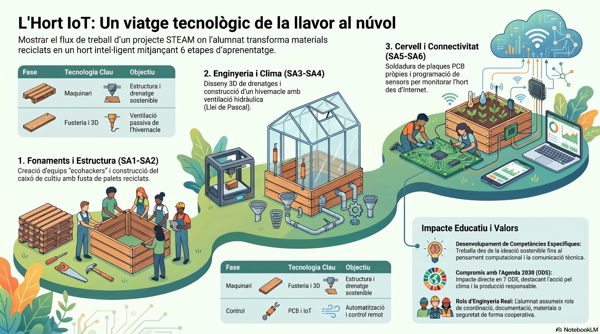

# 🌿 L'Hort IoT: Un viatge tecnològic de la llavor al núvol

Benvinguts i benvingudes al repositori central del projecte **L'Hort IoT**. Aquest curs no és una assignatura teòrica convencional; l'aula es converteix en un estudi d'enginyeria on l'alumnat s'enfrontarà a un repte real, pràctic i escalable durant tot l'any escolar.

El nostre objectiu final és dissenyar, construir, automatitzar i connectar a Internet un hort intel·ligent. Per a aconseguir-ho, treballarem sota la metodologia d'Aprenentatge Basat en Projectes (ABP), avançant a través de **6 Situacions d'Aprenentatge (SA)** estretament connectades. Cada repte superat serà la base de l'esglaó següent, integrant totes les disciplines STEAM (Ciència, Tecnologia, Enginyeria, Art i Matemàtiques).

## 📊 Visió global del projecte

---

## 🚀 El nostre full de ruta: Les 6 Fases del Projecte

### ♻️ SA 1 - Ecohackers
El punt de partida. Abans de construir, cal entendre l'impacte de la tecnologia en el nostre entorn. En aquesta fase inicial, l'alumnat adopta la mentalitat *"ecohacker"*: analitzar problemes mediambientals, repensar el cicle de vida dels materials i planificar com el nostre projecte pot ser 100% sostenible. Es defineixen els equips de treball, els rols i s'inicia el Portfolio digital.

### 🧰 SA 2 - Caixons de fusta reciclada
Ens posem la roba de feina i entrem al taller. Aprofitant fusta de palets i materials recuperats, l'alumnat aprendrà fusteria bàsica, presa de mesures, ús segur d'eines de tall i tècniques d'acoblament. El resultat físic serà el caixó de cultiu, uns fonaments robustos sobre els quals creixerà la resta del projecte.

### 💧 SA 3 - Disseny i impressió 3D 
Com evitem que les arrels es podrisquen per l'excés d'aigua? La solució està en el món digital. Farem el salt al disseny assistit per ordinador (CAD) utilitzant Tinkercad i aprendrem els paràmetres de laminació (Ultimaker Cura) per a imprimir en 3D unes reixes de drenatge a mida que s'ajustaran perfectament al fons dels nostres caixons de fusta.

### 🏡 SA 4 - L'hivernacle
El projecte creix en alçada i es tanca. Explorarem l'arquitectura bioclimàtica construint una coberta de canyes i plàstic que encaixe al caixó. El gran repte mecànic consistirà a aplicar la *Llei de Pascal* per a crear un sistema hidràulic amb xeringues de fluids incompressibles, capaç d'obrir i tancar una finestra de ventilació per a evacuar la calor acumulada de forma passiva.

### 🔌 SA 5 - Disseny i muntatge PCB
El nostre hort necessita començar a pensar. Entrarem en l'apassionant món de l'electrònica i el disseny de plaques de circuit imprés (PCB). L'alumnat aprendrà a dissenyar pistes, interpretar esquemes electrònics i utilitzar el soldador d'estany amb precisió per a muntar la seua pròpia placa de control *hardware*.

### 🌐 SA 6 - Hort IoT 
La culminació absoluta del projecte. Substituirem la força manual per servomotors i programarem un cervell electrònic capaç de prendre decisions basant-se en les dades dels sensors de temperatura i humitat. Finalment, connectarem el nostre hivernacle al "Núvol" (*Internet of Things*), permetent-nos monitorar i controlar l'estat de les plantes en temps real des de qualsevol pantalla del món.

---

## ⚙️ Connexió Curricular: Treball de les Competències Específiques

La naturalesa transversal d'aquest projecte garanteix que, al llarg de les 6 Situacions d'Aprenentatge, l'alumnat desenvolupe de forma profunda i progressiva **totes les Competències Específiques (CE)** del currículum oficial de Tecnologia:

* **CE 1. Idear i dissenyar solucions eficients i sostenibles:** Present des de la recerca inicial d'Ecohackers fins al disseny geomètric de l'hivernacle i el traçat dels circuits de la PCB, buscant sempre optimitzar recursos i minimitzar l'impacte ambiental.
* **CE 2. Prototipar, testar i validar sistemes tecnològics:** Es treballa mitjançant l'assaig-error amb models de cartó per a la cinemàtica de la finestra, la purga del circuit de fluids (Llei de Pascal) i l'anàlisi de toleràncies en enllaçar l'estructura de canyes amb la fusta i els caixons de l'hort.
* **CE 3. Comunicació i documentació digital tècnica:** L'alumnat ha de registrar, estructurar i publicar tot el procés en un entorn digital professional, a més de defensar públicament el seu projecte davant dels companys utilitzant un vocabulari tècnic rigorós.
* **CE 4. Fabricació segura i gestió de materials al taller:** Aquesta competència es desenvolupa intensament al taller de fusteria i en les fases de muntatge. Implica mecanitzar canyes i fusta, utilitzar correctament les eines de tall, realitzar soldadura d'estany i complir estrictament les normes de prevenció de riscos i ús d'EPIs.
* **CE 5. Treball en equip, cooperació i lideratge inclusiu:** L'estructura de treball simula un estudi d'enginyeria real on cada membre assumeix un rol fix i indispensable (coordinació, documentació, gestió de materials, o seguretat i qualitat), aprenent a organitzar-se i a resoldre conflictes de manera autònoma.
* **CE 6. Pensament computacional, automatització i robòtica:** Es posa en pràctica en la recta final del projecte en dissenyar els algorismes condicionals necessaris perquè la placa controladora llija les dades dels sensors, controle els servomotors i connecte l'hort a la xarxa IoT.

---

## 🌍 Referències curriculars i ODS

Aquest projecte està dissenyat i fonamentat sota el marc normatiu actual per a garantir la seua aplicació directa a l'aula:

* **Marc Estatal:** Basat en la normativa educativa espanyola vigent (LOMLOE).
* **Marc Autonòmic:** Decret 107/2022 de la Generalitat Valenciana, pel qual s'estableix l'ordenació i el currículum d'Educació Secundària Obligatòria, aplicat específicament a la matèria de Tecnologia i Digitalització (i especialment enfocat a 4t d'ESO).
* **Agenda 2030 (ODS):** El projecte transcendeix l'aspecte purament tècnic per a treballar de manera directa els Objectius de Desenvolupament Sostenible:
  * **ODS 4 (Educació de qualitat):** Mitjançant un aprenentatge STEAM competencial i basat en projectes reals.
  * **ODS 5 (Igualtat de gènere):** Fomentant les vocacions tecnològiques i científiques, i assegurant la paritat i la rotació equitativa en els rols de lideratge i ús d'eines al taller.
  * **ODS 7 (Energia neta i assequible):** A través de l'estudi de l'arquitectura bioclimàtica passiva.
  * **ODS 9 (Indústria, innovació i infraestructura):** Introduint l'alumnat en el disseny 3D, la fabricació de PCB i l'Internet de les Coses (IoT).
  * **ODS 11 (Ciutats i comunitats sostenibles):** Promovent la creació d'horts urbans.
  * **ODS 12 (Producció i consum responsables):** Fent de l'economia circular, el reciclatge de palets i la reutilització de materials la base de la construcció.
  * **ODS 13 (Acció pel clima):** Utilitzant la tecnologia i els sensors per a comprendre i adaptar-nos als factors climàtics.

---

## 📖 Guies d'ús del Repositori

Per a facilitar la navegació, la planificació i l'aplicació pràctica d'aquest projecte a l'aula, hem estructurat el contingut amb dues guies diferenciades:

* **👨‍🏫 Guia per al professorat:** Pensada per a l'equip docent. Inclou el guió d'explicacions clau sessió a sessió, les rúbriques d'avaluació detallades per blocs, consells per a gestionar la dinàmica d'aula i solucions als problemes tècnics més habituals.
* **👩‍🎓 Guia per a l'alumnat:** El manual d'instruccions de l'estudi d'enginyeria. Conté els passos exactes a seguir en cada sessió, els materials necessaris, el repartiment de les tasques per rols i les indicacions sobre què han de pujar al seu Portfolio digital.

---

## 🎯 Metodologia de Treball i Avaluació

Durant aquest viatge, l'alumnat no només serà avaluat pel prototip físic final. Es donarà la mateixa importància al **Procés**, la **Documentació** i la **Dinàmica cooperativa**. 

A través de la coavaluació entre iguals, les llistes de control de qualitat al taller i el seguiment de les tasques del diari de sessions, el projecte pretén fomentar valors com la resiliència davant les errades (*troubleshooting*), l'esperit crític i la capacitat de treballar de manera interdisciplinària per a trobar solucions en el món real.

**Preparats per a transformar materials reciclats en tecnologia connectada al món? Comencem!**

---

## 📞 Contacte

- **Matèria:** Tecnologia (4t ESO)
- **Autors:** Equip Smart Hort (Andrea, Rocio, Jesús, Rubén, Víctor)
